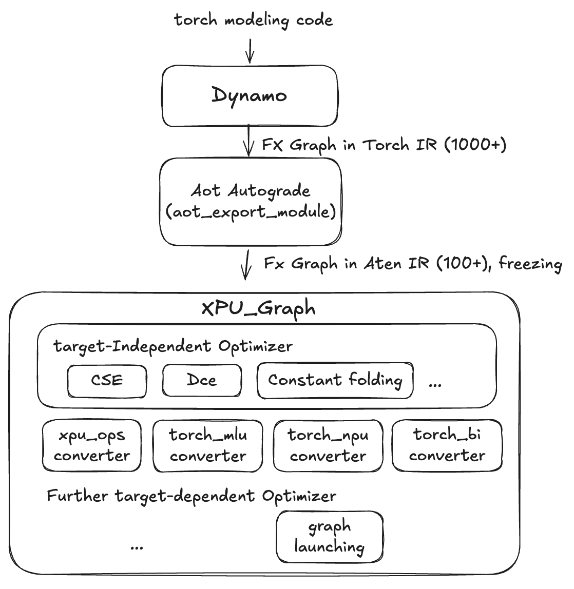

# xpu_graph

xpu_graph is a graph compiler based on torch [Fx graph](https://pytorch.org/docs/stable/fx.html) and [Aten IR](https://pytorch.org/docs/stable/torch.compiler_ir.html), which now is mainly for LLM-base model. It is mainly for:
* Vendor custom op conveter: convert less efficient ops (who will often cause redundant memory access) to custom fused op.
* Graph Optimization:
    * General graph optimizations, like: CSE, DCE, Constant folding, and more aggresive constant propagation.
    * Op-implements auto tuning (planning).
    * Graph-launching ability, like cuda graph, which now is supported by nesting 3rd compiler.
* Support users to resigter one-shot patterns to modify graph.

## Environment requirements
```bash
python -m pip install -r requirements.txt
```

## Usage
Install xpu_graph
```bash
python -m pip install .
```

Then you can use xpu_graph with [PT2 compile](https://pytorch.org/docs/stable/generated/torch.compile.html) like this:

```python
def foo(x, y):
    z = x + y
    another_z = x + y
    return z, another_z

from xpu_graph.compiler import XpuGraph
compiled_foo = torch.compile(foo, backend=XpuGraph())
compiled_foo(torch.randn(10), torch.randn(10))

```
