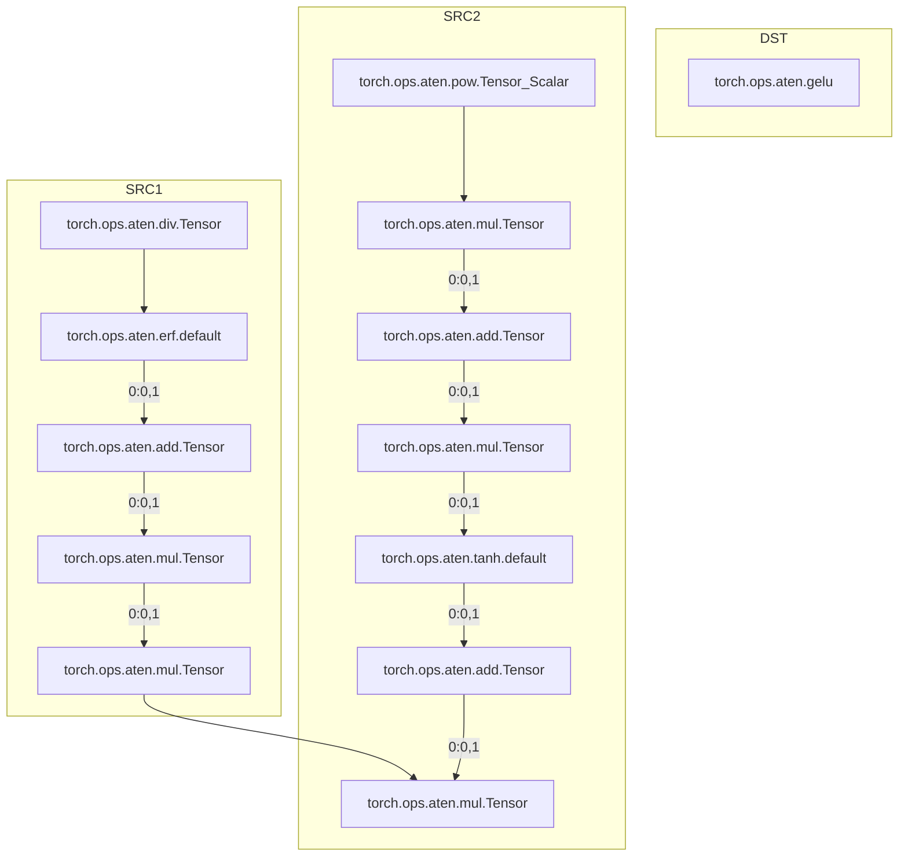

Gelu pattern

```mermaid
graph TD
subgraph DST
    gelu[torch.ops.aten.gelu]
end
subgraph SRC1
    div[torch.ops.aten.div.Tensor] --> erf[torch.ops.aten.erf.default]
    erf --> |0:0,1| add[torch.ops.aten.add.Tensor]
    add --> |0:0,1| mul[torch.ops.aten.mul.Tensor]
    mul --> |0:0,1| mul2[torch.ops.aten.mul.Tensor]
end
subgraph SRC2
    mul2[torch.ops.aten.mul.Tensor] --> mul5[torch.ops.aten.mul.Tensor]
    pow[torch.ops.aten.pow.Tensor_Scalar] --> mul3[torch.ops.aten.mul.Tensor]
    mul3 --> |0:0,1| add2[torch.ops.aten.add.Tensor]
    add2 --> |0:0,1| mul4[torch.ops.aten.mul.Tensor]
    mul4 --> |0:0,1| tanh[torch.ops.aten.tanh.default]
    tanh --> |0:0,1| add3[torch.ops.aten.add.Tensor]
    add3 --> |0:0,1| mul5[torch.ops.aten.mul.Tensor]
end
```
