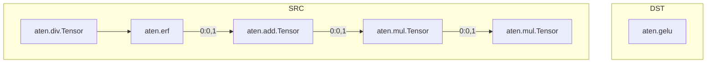

Gelu pattern

```mermaid
graph TD
subgraph DST
    gelu[aten.gelu]
end
subgraph SRC
    div[aten.div.Tensor] --> erf[aten.erf]
    erf --> |0:0,1| add[aten.add.Tensor]
    add --> |0:0,1| mul[aten.mul.Tensor]
    mul --> |0:0,1| mul2[aten.mul.Tensor]
end
```