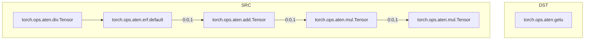

Gelu pattern

```mermaid
graph TD
subgraph DST
    gelu[torch.ops.aten.gelu]
end
subgraph SRC
    div[torch.ops.aten.div.Tensor] --> erf[torch.ops.aten.erf.default]
    erf --> |0:0,1| add[torch.ops.aten.add.Tensor]
    add --> |0:0,1| mul[torch.ops.aten.mul.Tensor]
    mul --> |0:0,1| mul2[torch.ops.aten.mul.Tensor]
end
```