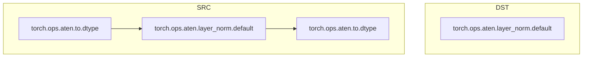

RemoveLayerNormCast1 pattern

```mermaid
graph TD
subgraph DST
    layernorm_[torch.ops.aten.layer_norm.default]
end
subgraph SRC
    pre_cast[torch.ops.aten.to.dtype] --> layernorm[torch.ops.aten.layer_norm.default]
    layernorm[torch.ops.aten.layer_norm.default] --> post_cast[torch.ops.aten.to.dtype]
end

```
