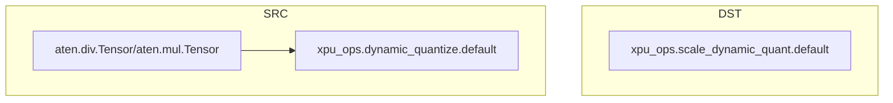

```mermaid
graph TD
subgraph DST
    scale_dynamic_quant[xpu_ops.scale_dynamic_quant.default]
end
subgraph SRC
    scale[aten.div.Tensor/aten.mul.Tensor] --> dynamic_quantize[xpu_ops.dynamic_quantize.default]
end
```